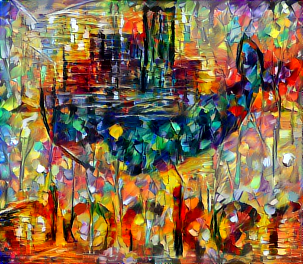
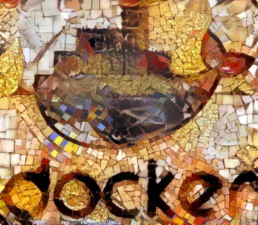
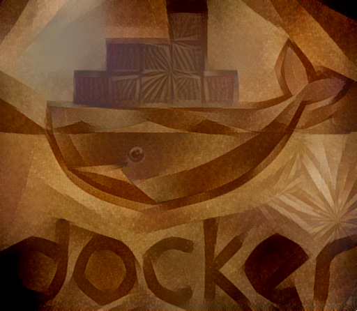
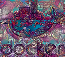
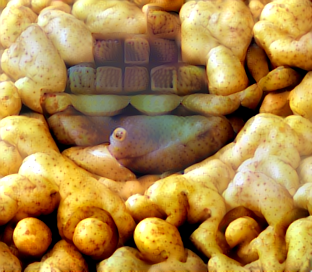
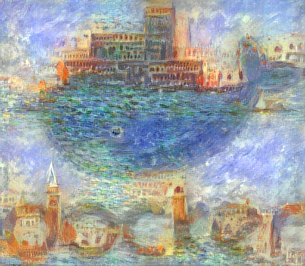
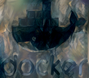

# neural-style-docker

A dockerized version of the [neural style algorithm by jcjohnson](https://github.com/jcjohnson/neural-style), with a simple flask server to produce images. [nvidia-docker](https://github.com/NVIDIA/nvidia-docker) is used to make use of GPU hardware if available.

## Install

Prerequisites

* [docker](https://www.docker.com/)
* [nvidia-docker](https://github.com/NVIDIA/nvidia-docker)
* Appropriate nvidia drivers for your GPU

Once this is met you can build the image with

	nvidia-docker build -t neural-style .

## Use as command

You can invoke the neural-style command by simply running a container of this image, for example:

	nvidia-docker run --rm neural-style -h

produces the usage help.

To apply the neural-style method on some host images, map the host folder with such images to the container /images folder through a volume such as

	nvidia-docker run --rm -v $(pwd):/images neural-style -backend cudnn -cudnn_autotune -content_image content.png -style_image style.png

The container uses as work directory the /images folder, so the results will be readily available at the mounted host folder.

In order to take full advantage of the cudnn libraries (also included in the image) the options -backend cudnn -cudnn_autotune are always recommended.

As an example, let's redraw Docker's logo in the famous style of Van Gogh's Starry Night:

	nvidia-docker run --rm -v $(pwd):/images neural-style -backend cudnn -cudnn_autotune -content_image img/docker.png -style_image img/starryNight.jpg

### Generating variants

Running the command 

	nvidia-docker run --rm --entrypoint python neural-style /neural-style/variants.py

will generate several variants of the same image blends, for different neural-style parameters that work well in general. This is useful for producing several versions of the same blend and afterwards hand-picking the best one. Run this command with the -h option to obtain usage help.

For example, to generate different variants of Docker logo + Starry Night:

	nvidia-docker run --rm -v $(pwd):/images --entrypoint python neural-style /neural-style/variants.py --contents img/docker.png --styles img/starryNight.jpg --outfolder .

	
## Use as server

You can also deploy neural-style as an API REST server, running

	nvidia-docker run -d -p 80:80 --entrypoint "python" neural-style /neural-style/app.py

and you will get a server listening to localhost:80. Docs on API usage are available at http://localhost:80/v1/ui/ . This server only supports basic parameters, so the command method above should be preferred.

