# neural-style-docker

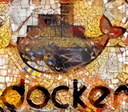

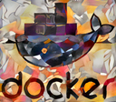
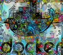
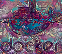
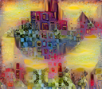

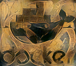
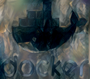
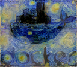

A dockerized version of neural style transfer algorithms.
[nvidia-docker](https://github.com/NVIDIA/nvidia-docker) is used to make use of GPU hardware.

## Install

### Prerequisites

* [docker](https://www.docker.com/)
* [nvidia-docker](https://github.com/NVIDIA/nvidia-docker)
* Appropriate [nvidia drivers](http://www.nvidia.es/Download/index.aspx) for your GPU

### Installation

You can either pull the Docker image from Docker Hub with

	docker pull albarji/neural-style

or build the image locally with

	make

### Usage

This docker container operates by receiving images through a volume to be mounted at the **/images** directory.
For instance, to apply a **style** image *somestyle.png* onto a **content** image *somecontent.png* located at the 
current directory, run: 

    nvidia-docker run --rm -v $(pwd):/images albarji/neural-style --content somecontent.png --style somestyle.png

All paths referenced in the arguments are regarded as relative to the /images folder within the container. So in case
of having a local structure such as

    contents/
        docker.png
        whatever.jpg
    styles/
        picasso.png
        vangogh.png
    results/
        something.md
        
applying the *vangogh.png* style to the *docker.png* image amounts to

    nvidia-docker run --rm -v $(pwd):/images albarji/neural-style --content contents/docker.png --style styles/vangogh.png
    
You can provide several content and style images, in which case all cross-combinations will be generated.

    nvidia-docker run --rm -v $(pwd):/images albarji/neural-style --content contents/docker.png contents/whatever.jpg --style styles/vangogh.png styles/picasso.png
    
By default all generated images are saved into the container **/images**. When running the commands above the results
will get saved into the host local folder (through the mounted volume). If you want to locate the generated images at a 
different folder you can use the --output parameters. Note that, similarly to the --content and --style arguments,
the path provided in --output will be regarded as relative to the /images folder. For instance, using the local 
structure from the example above, saving the generated images in the "results" folder will require the following:

    nvidia-docker run --rm -v $(pwd):/images albarji/neural-style --content contents/docker.png --style styles/vangogh.png --output results

### Fine tuning the results

Better results can be attained by modifying some of the transfer parameters.

#### Algorithm

The --alg parameter allows changing the neural style transfer algorithm to use.

* **gatys**: highly detailed transfer, slow processing times (default)
* **gatys-multiresolution**: multipass version of Gatys method, provides even better quality, but is also much slower
* **chen-schmidt**: fast patch-based style transfer
* **chen-schmidt-inverse**: even faster aproximation to chen-schmidt through the use of an inverse network

The following example illustrates kind of results to be expected by these different algorithms

| Content image | Algorithm | Style image |
| ------------- | --------- | ----------- |
| 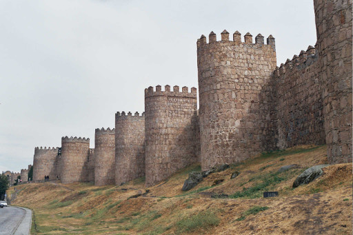 | Gatys 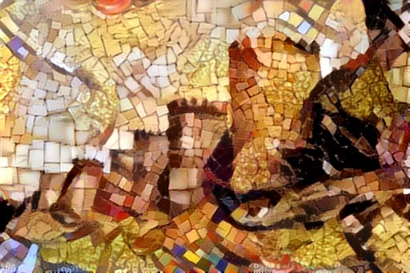 | 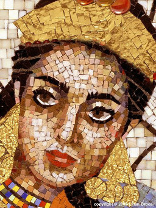 |
|  | Gatys Multiresolution 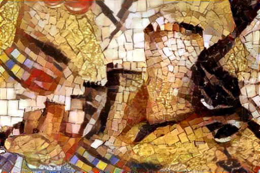 |  |
|  | Chen-Schmidt 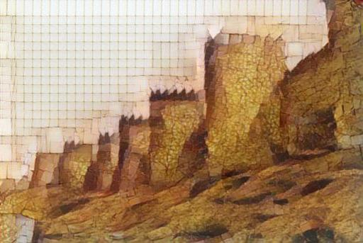 |  | 
|  | Chen-Schmidt Inverse  |  | 

#### Output image size

By default the output image will have the same size as the input content image, but a different target size can be
specified through the --size parameter. For example, to produce a 512 image

    nvidia-docker run --rm -v $(pwd):/images albarji/neural-style --content contents/docker.png --style styles/vangogh.png --size 512
    
Note the proportions of the image are maintained, therefore the value of the size parameter is understood as the width 
of the target image, the height being scaled accordingly to keep proportion.

If the image to be generated is large, a tiling strategy will be used, applying the neural style transfer method
to small tiles of the image and stitching them together. Tiles overlap to provide some guarantees on overall
consistency, though results might vary depending on the algorithm used.

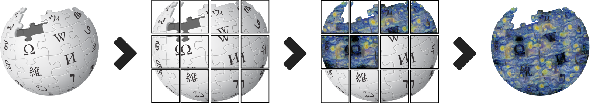

The size of these tiles is defined through the configuration file **gpuconfig.json** inside the container.
This file contains dictionary keys for different GPU models and each neural style algorithm. Your GPU will be 
automatically checked against the registered configurations and the appropriate tile size will be selected. These values
have been chosen to maximize the use of the available GPU memory, asumming the whole GPU is available for the style
transfer task.  

If your GPU is not included in the configuration file, the *default* values will we used instead, though to obtain
better performance you might want to edit this file and rebuild the docker images.

Note also that since the full style image is applied to each tile separately, as a result the style features will appear
as smaller in the rendered image.

#### Style weight

Gatys and Gatys Multiresolution algorithms allow to adjust the amount of style imposed over the content image, by means 
of the --sw parameter. By default a value of **5** is used, meaning the importance of the style is 5 times the 
importance of the content. Smaller weight values result in the transfer of colors, while higher values transfer textures 
and even objects of the style.

If several weight values are provided, all combinations will be generated. For instance, to generate the same
style transfer with three different weights, use

    nvidia-docker run --rm -v $(pwd):/images albarji/neural-style --content contents/docker.png --style styles/vangogh.png --sw 5 10 20
    
Note also that they Gatys Multiresolution algorithm tends to produce a stronger style imprint, and this you might want
to use weight values smaller than the default (e.g. 3). 

#### Style scale

If the transferred style results in too large or too small features, the scaling can be modified through the --ss 
parameter. A value of **1** keeps the style at its original scale. Smaller values reduce the scale of the style,
resulting in smaller style features in the output image. Conversely, larger values produce larger features. 
Similarly to the style weight, several values can be provided

    nvidia-docker run --rm -v $(pwd):/images albarji/neural-style --content contents/docker.png --style styles/vangogh.png --ss 0.75 1 1.25
    
Warning: using a value larger than **1** will increasy the memory consumption. 

### Transparency

Transparency values (alpha channels) are preserved by the neural style transfer. Note for instance how in the Wikipedia
logo example above the transparent background is not transformed.

## References

* [Gatys et al method](https://arxiv.org/abs/1508.06576), [implementation by jcjohnson](https://github.com/jcjohnson/neural-style)
* [Chen-Schmidt method](https://arxiv.org/pdf/1612.04337.pdf), [implementation](https://github.com/rtqichen/style-swap)
* [A review on style transfer methods](https://arxiv.org/pdf/1705.04058.pdf)
* [Controlling Perceptual Factors in Neural Style Transfer](https://arxiv.org/abs/1611.07865)
* [Neural-tiling method](https://github.com/ProGamerGov/Neural-Tile)
* [Multiresolution strategy](https://gist.github.com/jcjohnson/ca1f29057a187bc7721a3a8c418cc7db)
* [The Wikipedia logo](https://en.wikipedia.org/wiki/Wikipedia_logo)
